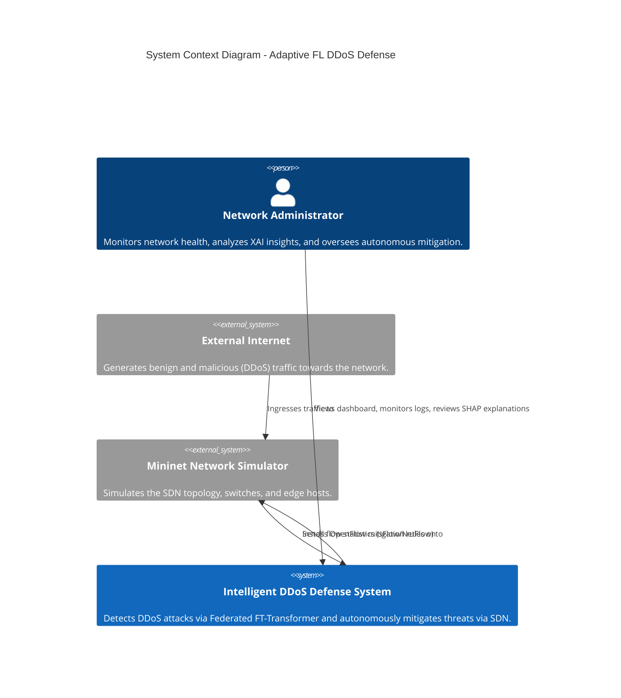
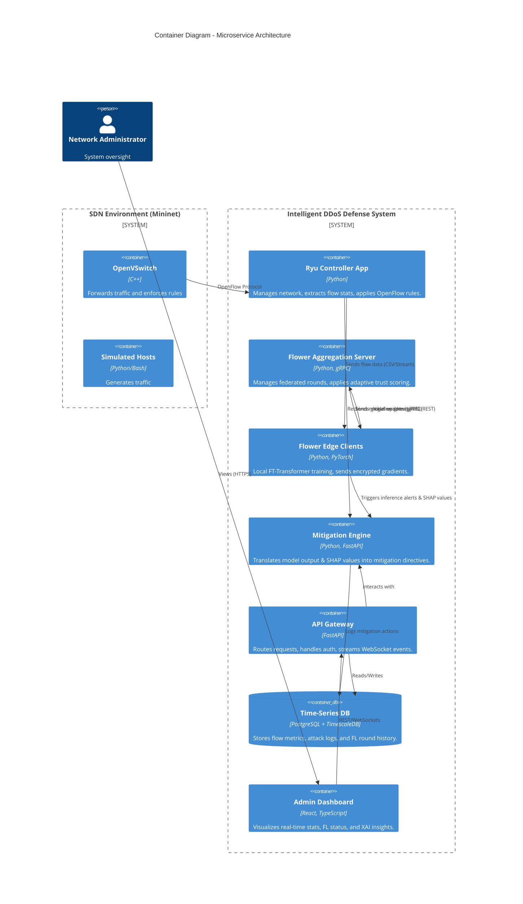
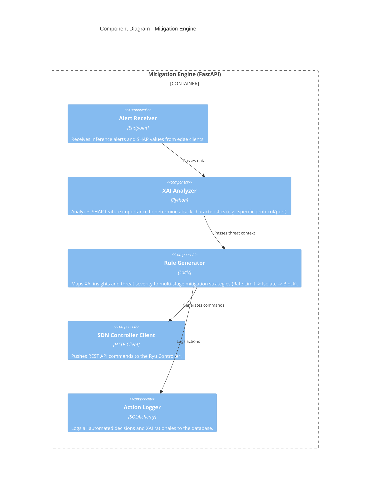
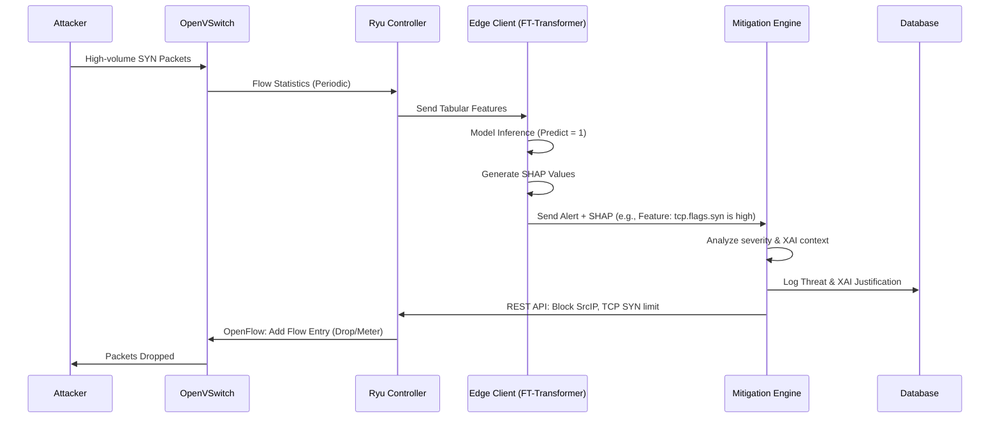

# System Architecture Document

## Project Title
Adaptive Privacy-Preserving Federated Learning using FT-Transformer for Intelligent DDoS Detection and Autonomous Multi-Stage Mitigation.

---

## 1. System Context Diagram
The System Context level illustrates the system's relationship with its external environment (users, networks, and external services).



## 2. Container Diagram
This expands the System Context to show the high-level software architecture and containerized execution units.



## 3. Component Diagram (Mitigation Engine)
Zooming into the Mitigation Engine to show internal components.



## 4. Deployment Diagram
Illustrates the physical/virtual deployment topology using Docker and Mininet.

```mermaid
graph TD
    subgraph "Physical Machine / VM"
        subgraph "Docker Compose Network"
            DB[(PostgreSQL / TimescaleDB)]
            API[API Gateway (FastAPI)]
            DASH[Dashboard (React/Nginx)]
            FL_SERVER[Flower Server Container]
            MITIGATION[Mitigation Engine]
            RYU[Ryu Controller Container]
        end

        subgraph "Mininet VM / Container"
            OVS1[OpenVSwitch 1]
            OVS2[OpenVSwitch 2]
            H1[Host 1]
            H2[Host 2]
            H3[Host 3 - Attacker]
            
            subgraph "Edge Nodes (Simulated)"
                FL_C1[Flower Client 1]
                FL_C2[Flower Client 2]
            end
        end
    end

    RYU <-->|OpenFlow| OVS1
    RYU <-->|OpenFlow| OVS2
    OVS1 --- H1
    OVS1 --- H2
    OVS2 --- H3
    
    H1 -.-> FL_C1
    H2 -.-> FL_C2
    
    FL_C1 <-->|gRPC| FL_SERVER
    FL_C2 <-->|gRPC| FL_SERVER
    
    RYU <-->|REST| MITIGATION
```

## 5. Data Flow Diagram (DFD Level 1)
Shows the flow of data through the system during inference and mitigation.

```mermaid
flowchart TD
    Traffic[Network Traffic] --> OVS[OpenVSwitch]
    OVS -->|Flow Stats| Ryu[Ryu Controller]
    Ryu -->|Tabular Flow Features| EdgeApp[Edge Client / Inference App]
    EdgeApp -->|Predict| FT[FT-Transformer Model]
    FT -->|Alert (DDoS Detected)| XAI[SHAP Explainer]
    XAI -->|SHAP Values + Threat Prob| MitEngine[Mitigation Engine]
    MitEngine -->|Log| DB[(Database)]
    MitEngine -->|Flow Rules| Ryu
    Ryu -->|OpenFlow Mod| OVS
    OVS -->|Drop/Rate-Limit| Traffic
```

## 6. Sequence Diagram
Demonstrates the chronological order of operations during a DDoS attack detection and mitigation scenario.



## 7. Threat Model
Identifies potential threats to the system architecture and proposed mitigations.

| Threat Category | Specific Threat | Vector / Impact | Mitigation Strategy |
| :--- | :--- | :--- | :--- |
| **Federated Learning** | Model Poisoning (Byzantine) | Malicious client sends falsified gradients to ruin global model. | **Adaptive Trust Scoring:** Server compares gradient cosine similarity; penalizes outliers. |
| **Federated Learning** | Inference Attacks | Adversary infers raw data patterns from intercepted model weights. | **Differential Privacy (DP):** Add Laplacian/Gaussian noise to gradients before transmission. |
| **SDN/Network** | Controller DoS | Overwhelming the Ryu controller with Packet-In messages. | **Switch-level Rate Limiting:** Implement rate limiters on OVS for unhandled packets. |
| **API/Backend** | Unauthorized Access | Attacker accesses Mitigation Engine to drop legitimate traffic. | **mTLS & JWT:** Strict internal authentication between containers and API gateway. |
| **Model** | Evasion Attacks | Attacker modifies DDoS signatures slightly to bypass the model. | **Continuous Learning:** FL allows constant updating of the model with new local patterns. |

## 8. Trust Model
Defines the trust boundaries within the distributed system.

*   **Zero-Trust Edge:** Edge clients (switches/simulated hosts running Flower clients) are considered **untrusted**. They may be compromised and act maliciously.
*   **Trusted Core:** The Flower Server, Mitigation Engine, API Gateway, and Database reside in a secure, centralized (or logically centralized) trusted zone.
*   **Controller Trust:** The Ryu SDN Controller is implicitly trusted and resides in the secure core, interacting with untrusted data planes (OVS).
*   **Verification:** All communications across trust boundaries (Edge -> Core) require mutual TLS (mTLS). Model updates from untrusted edges are subjected to mathematical verification (Trust Scoring).

## 9. Microservice Architecture
The system is decoupled into independent, containerized services:
1.  **SDN Microservice (Ryu):** Handles pure network topology, OpenFlow messaging, and flow extraction.
2.  **FL Server Microservice:** Dedicated gRPC server managing the Federated Learning state machine (Flower).
3.  **Inference/Client Microservice:** Edge nodes running inference and local training loops.
4.  **Mitigation Microservice (FastAPI):** Stateless logic engine processing alerts and issuing REST commands.
5.  **Analytics/API Microservice (FastAPI):** Serves the frontend, aggregates database metrics, handles WebSockets.
6.  **Database Service:** TimescaleDB optimized for fast ingestion of time-series network metrics.

## 10. Communication Flow
*   **Edge <-> FL Server:** `gRPC` (High performance, binary, bidirectional streaming for weights).
*   **Ryu <-> Switches:** `OpenFlow 1.3` (TCP).
*   **Ryu <-> Mitigation Engine:** `REST API / HTTP` (JSON).
*   **Edge <-> Mitigation Engine:** `REST API` or `gRPC` (for sending alerts/SHAP).
*   **API Gateway <-> Dashboard:** `REST API` (HTTPS) and `WebSockets` (for real-time dashboard updates).
*   **Services <-> Database:** `TCP/IP` (PostgreSQL connection pool via SQLAlchemy).

## 11. Failure Handling
*   **FL Client Disconnect:** The Flower server is configured with a minimum quorum (`min_fit_clients`). If a client drops, the round proceeds if the quorum is met, otherwise, it aborts and retries.
*   **Controller Failure:** In a production setup, Ryu would be deployed in a High Availability (HA) cluster. For this prototype, failure of Ryu halts new rule installation, but switches continue operating on existing cached rules.
*   **Mitigation Engine Crash:** Designed statelessly. Managed by Docker/Kubernetes restart policies. Pending alerts are retried by edge clients with exponential backoff.
*   **Database Outage:** API Gateway implements circuit breakers to prevent cascading failures if TimescaleDB goes down.

## 12. Scalability Strategy
*   **Horizontal Scaling (Detection):** The Federated Learning architecture inherently scales. Adding more network edge nodes distributes the inference and training load.
*   **Vertical/Horizontal Scaling (Backend):** FastAPI services (API Gateway, Mitigation Engine) are stateless and can be horizontally scaled behind a load balancer (Nginx).
*   **Database:** TimescaleDB is chosen specifically because it partitions SQL tables based on time, allowing massive scalability for time-series flow logs.

## 13. Design Decisions
1.  **FT-Transformer over CNN/RNN:** Justified because network flows are tabular. Transformers process categorical (e.g., protocols, flags) and numerical (e.g., byte counts) data natively via feature tokenization, outperforming spatial/sequential models.
2.  **Flower over PySyft:** Flower is chosen for its production readiness, agnostic nature to the underlying ML framework (PyTorch), and excellent support for edge-device deployment.
3.  **SHAP for XAI:** SHAP is model-agnostic and provides consistent, theoretically sound (game theory) feature importances, which are critical for automated rule generation (e.g., knowing *why* it's a DDoS tells the mitigation engine *what* to block).
4.  **TimescaleDB over MongoDB:** Network logs are highly structured and time-dependent. TimescaleDB provides the strict schema of PostgreSQL with time-series optimized ingestion rates, outperforming NoSQL for this specific use case.
5.  **FastAPI over Django/Flask:** Required for asynchronous I/O, vital for handling thousands of concurrent flow alerts and WebSocket connections to the dashboard with minimal latency.
