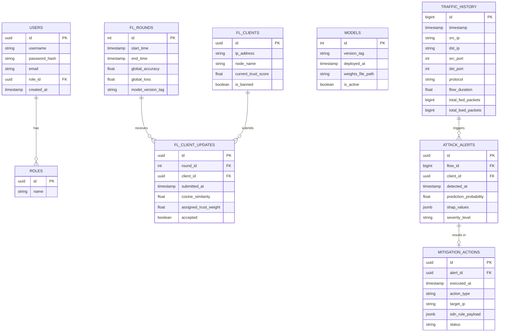

# Database Architecture Document

## Overview
This document defines the PostgreSQL database schema, optimized with TimescaleDB extensions to handle the high-throughput time-series data generated by the network flow extractor and the mitigation engine.

## 1. Entity-Relationship (ER) Diagram

## 2. Table Definitions & Constraints

### 2.1 Core Identity
**Table:** `users`
*   `id` (UUID, Primary Key, Default: `uuid_generate_v4()`)
*   `username` (VARCHAR(50), Unique, Not Null)
*   `password_hash` (VARCHAR(255), Not Null)
*   `email` (VARCHAR(255), Unique, Not Null)
*   `role_id` (UUID, Foreign Key -> `roles.id`)
*   `created_at` (TIMESTAMP, Default: `NOW()`)

**Table:** `roles`
*   `id` (UUID, Primary Key)
*   `name` (VARCHAR(50), Unique, Not Null) - e.g., 'ADMIN', 'ANALYST', 'READONLY'

### 2.2 Federated Learning State
**Table:** `fl_rounds`
*   `id` (SERIAL, Primary Key)
*   `start_time` (TIMESTAMP, Not Null)
*   `end_time` (TIMESTAMP, Nullable)
*   `global_accuracy` (FLOAT, Nullable)
*   `global_loss` (FLOAT, Nullable)
*   `model_version_tag` (VARCHAR(100), Not Null)

**Table:** `fl_clients`
*   `id` (UUID, Primary Key)
*   `ip_address` (INET, Not Null)
*   `node_name` (VARCHAR(100), Unique, Not Null)
*   `current_trust_score` (FLOAT, Default: 1.0)
*   `is_banned` (BOOLEAN, Default: FALSE)

**Table:** `fl_client_updates`
*   `id` (UUID, Primary Key)
*   `round_id` (INT, Foreign Key -> `fl_rounds.id`, On Delete Cascade)
*   `client_id` (UUID, Foreign Key -> `fl_clients.id`)
*   `submitted_at` (TIMESTAMP, Default: `NOW()`)
*   `cosine_similarity` (FLOAT, Not Null)
*   `assigned_trust_weight` (FLOAT, Not Null)
*   `accepted` (BOOLEAN, Not Null)

### 2.3 Model Management
**Table:** `models`
*   `id` (SERIAL, Primary Key)
*   `version_tag` (VARCHAR(100), Unique, Not Null)
*   `deployed_at` (TIMESTAMP, Default: `NOW()`)
*   `weights_file_path` (VARCHAR(255), Not Null)
*   `is_active` (BOOLEAN, Default: FALSE)
*   *Constraint:* Partial unique index to ensure only one model is `is_active = TRUE`.

### 2.4 Telemetry & Threat Intelligence (TimescaleDB HyperTables)
**Table:** `traffic_history` (Converted to HyperTable)
*   `id` (BIGSERIAL)
*   `timestamp` (TIMESTAMPTZ, Not Null) - *Partition Key*
*   `src_ip` (INET, Not Null)
*   `dst_ip` (INET, Not Null)
*   `src_port` (INT, Not Null)
*   `dst_port` (INT, Not Null)
*   `protocol` (VARCHAR(10), Not Null)
*   `flow_duration` (FLOAT)
*   `total_fwd_packets` (BIGINT)
*   `total_bwd_packets` (BIGINT)
*   *Constraint:* Primary Key (`id`, `timestamp`) required by TimescaleDB.

**Table:** `attack_alerts` (Converted to HyperTable)
*   `id` (UUID)
*   `detected_at` (TIMESTAMPTZ, Not Null) - *Partition Key*
*   `flow_id` (BIGINT, Nullable)
*   `flow_timestamp` (TIMESTAMPTZ, Nullable)
*   `client_id` (UUID, Foreign Key -> `fl_clients.id`)
*   `prediction_probability` (FLOAT, Not Null)
*   `shap_values` (JSONB, Not Null) - *Stores top features contributing to the alert*
*   `severity_level` (VARCHAR(20), Not Null) - e.g., 'LOW', 'MEDIUM', 'CRITICAL'
*   *Constraint:* Primary Key (`id`, `detected_at`). Foreign Key to `traffic_history` requires matching `timestamp`.

### 2.5 Mitigation & SDN Operations
**Table:** `mitigation_actions`
*   `id` (UUID, Primary Key)
*   `alert_id` (UUID, Not Null)
*   `alert_detected_at` (TIMESTAMPTZ, Not Null)
*   `executed_at` (TIMESTAMP, Default: `NOW()`)
*   `action_type` (VARCHAR(50), Not Null) - e.g., 'RATE_LIMIT', 'BLOCK_IP', 'ISOLATE_PORT'
*   `target_ip` (INET, Not Null)
*   `sdn_rule_payload` (JSONB, Not Null) - *The exact JSON sent to Ryu*
*   `status` (VARCHAR(20), Not Null) - e.g., 'PENDING', 'SUCCESS', 'FAILED'
*   *Constraint:* Foreign Key (`alert_id`, `alert_detected_at`) -> `attack_alerts`.

## 3. Indexing Strategy

1.  **B-Tree Indexes:**
    *   `users(username)`, `users(email)` for fast authentication lookups.
    *   `fl_clients(node_name)` for quick edge node identification.
    *   `mitigation_actions(target_ip)` to quickly find history of actions against a specific IP.

2.  **GIN (Generalized Inverted Index):**
    *   `attack_alerts(shap_values)` to allow rapid querying of JSONB data (e.g., finding all attacks where `tcp.flags.syn` was the primary SHAP feature).
    *   `mitigation_actions(sdn_rule_payload)` to search historical OpenFlow rule payloads.

3.  **TimescaleDB Automatic Indexes:**
    *   TimescaleDB automatically indexes the `timestamp` / `detected_at` partition keys on the HyperTables for incredibly fast time-range queries.

## 4. Migration Strategy

*   **Tool:** Alembic (integrated with SQLAlchemy).
*   **Workflow:**
    1.  Changes are made to SQLAlchemy ORM models in `src/mitigation_engine/db/models.py`.
    2.  Developer runs `alembic revision --autogenerate -m "description"`.
    3.  Alembic generates a migration script in `alembic/versions/`.
    4.  Developer reviews the script (especially ensuring TimescaleDB `create_hypertable` commands are manually added to the migration if a new time-series table is created).
    5.  Execute `alembic upgrade head` in CI/CD pipelines before deploying the API container.

## 5. Backup & Retention Strategy

### 5.1 Continuous Aggregates (TimescaleDB)
To prevent `traffic_history` from growing infinitely:
*   Create Continuous Aggregates to roll up flow data into hourly/daily summaries (e.g., `avg_flow_duration`, `sum_packets` grouped by `src_ip`).

### 5.2 Data Retention Policies
*   **Raw `traffic_history`:** Dropped after 7 days using TimescaleDB's `add_retention_policy()`.
*   **`attack_alerts` & `mitigation_actions`:** Retained indefinitely for model retraining, auditing, and compliance.
*   **`fl_client_updates`:** Aggregated and dropped after 30 days; only the `fl_rounds` summary is kept indefinitely.

### 5.3 Backup Mechanism
*   **Daily Backups:** `pg_dump` executed via a cron job inside a sidecar container, exporting a compressed custom format (`-Fc`) backup to an S3 bucket or local volume.
*   **Write-Ahead Logging (WAL):** Enabled for Point-in-Time Recovery (PITR) in case of a catastrophic database failure, allowing restoration to any transaction just prior to the crash.
