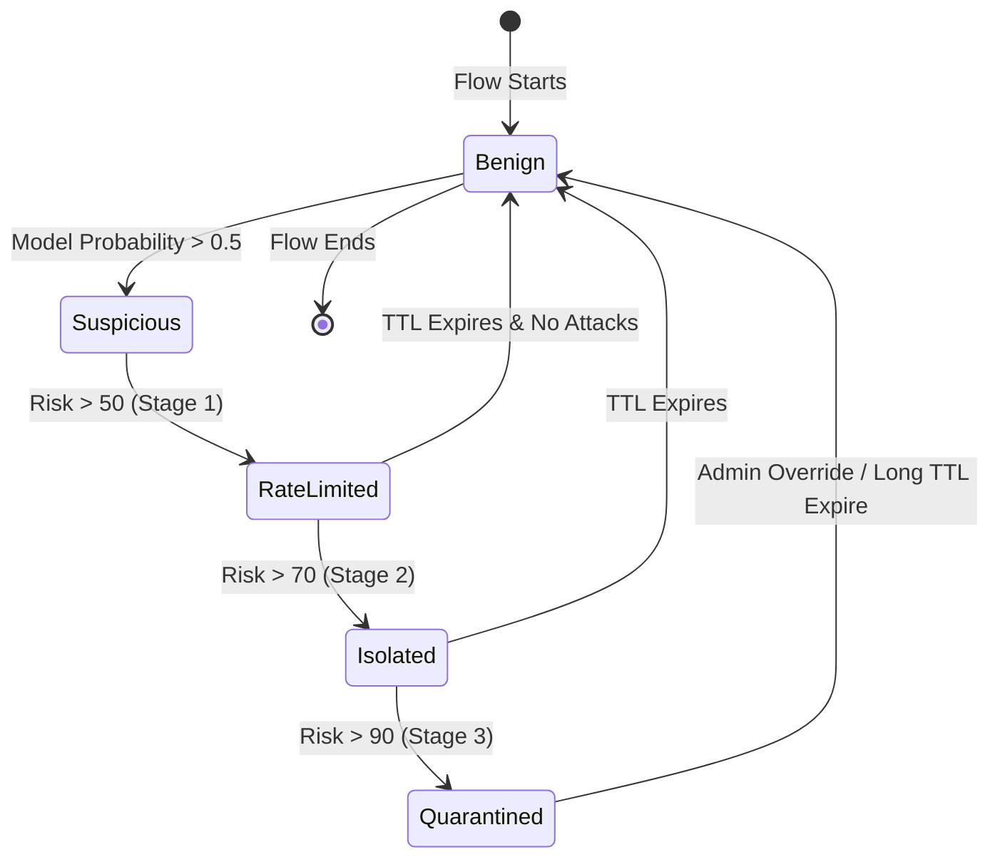
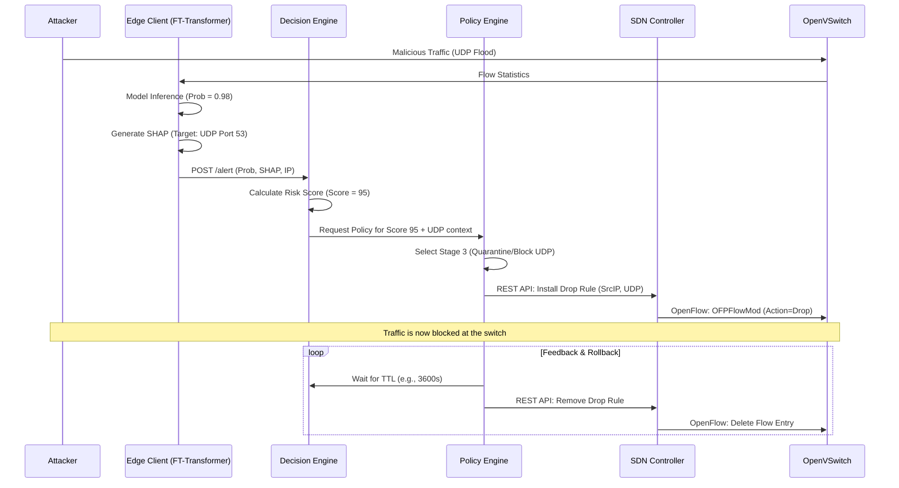

# Autonomous Mitigation Engine Architecture

## Overview
The Autonomous Mitigation Engine is the active defense component of the system. It translates AI-driven alerts (probabilities) and Explainable AI insights (SHAP values) into actionable network policies. It dynamically interacts with both SDN controllers (Ryu) and host-level firewalls (iptables) to enforce multi-stage mitigation strategies without human intervention.

---

## 1. Core Components

### 1.1 Decision Engine
*   **Responsibility:** Receives incoming alerts from Edge Clients. Computes a dynamic **Risk Score** for the offending entity (IP address or sub-network) based on the FT-Transformer prediction probability, historical alert frequency, and the severity of the targeted asset.
*   **Logic:** Integrates XAI (SHAP). If the AI predicts DDoS with 0.95 probability, the Decision Engine reads the SHAP values to understand *why*.

### 1.2 Policy Engine
*   **Responsibility:** Maps the computed Risk Score and SHAP insights to a specific Mitigation Policy.
*   **Logic:** Employs a graduated response (Multi-Stage Mitigation). Instead of immediately blocking an IP (which could be spoofed), it escalates from Rate Limiting to Isolation, and finally to Quarantine.

### 1.3 Execution Adapters
*   **SDN Adapter (Ryu Controller):** Converts policies into OpenFlow 1.3 `OFPFlowMod` messages (e.g., setting meters for rate limiting or drop rules).
*   **Host Adapter (iptables):** In legacy or hybrid environments lacking pure SDN, this adapter SSHs into edge gateways to apply `iptables` or `ufw` rules.

---

## 2. Risk Scoring & Feedback Loop

### 2.1 Dynamic Risk Scoring
$Risk(IP) = (w_1 \times \text{Prediction\_Prob}) + (w_2 \times \text{Attack\_Frequency}) - (w_3 \times \text{Time\_Decay})$

*   A high `Prediction_Prob` immediately spikes the risk.
*   Repeated alerts from the same IP compound the score.
*   If an IP stops sending malicious traffic, the `Time_Decay` lowers the risk back to a benign state.

### 2.2 The Feedback Loop
The engine continuously monitors the network state *after* applying a mitigation. 
*   If Rate Limiting is applied but the target server's CPU remains at 99%, the feedback loop reports failure to the Decision Engine, which automatically escalates the Risk Score and triggers the next policy tier (Quarantine).

---

## 3. Mitigation Policies (Multi-Stage)

| Stage | Risk Score | SHAP Insight | Action Taken | Enforcement Point |
| :--- | :--- | :--- | :--- | :--- |
| **Stage 1: Rate Limiting** | Medium (50-70) | `tcp.flags.syn` is high | Limit TCP SYN packets to 10/sec for the Source IP. | SDN Switch (OpenFlow Meter) |
| **Stage 2: Traffic Isolation** | High (71-89) | Specific dest port (e.g., 80) targeted | Route traffic from Source IP to a Honeypot or Deep Packet Inspection (DPI) VLAN. | SDN Controller (Flow Rerouting) |
| **Stage 3: Quarantine / Block** | Critical (90+) | Massive volumetric anomaly | Hard drop all packets from Source IP. | SDN Switch (Drop Action) / iptables |

---

## 4. Rollback Mechanism
Mitigation actions are not permanent. They are assigned a Time-to-Live (TTL).
1.  **TTL Expiration:** A background task (e.g., Celery/Redis) tracks the expiration of rules.
2.  **State Reversion:** Once the TTL expires, the engine sends a command to the Ryu controller to delete the specific OpenFlow rule, restoring normal connectivity.
3.  **Observation Window:** The IP is placed in a "probation" state. If it immediately launches an attack again, the Risk Score doubles, and a new rule is applied with an exponentially longer TTL.

---

## 5. State Diagram (Threat Lifecycle)

---

## 6. Sequence Diagram (Detection to Mitigation)

