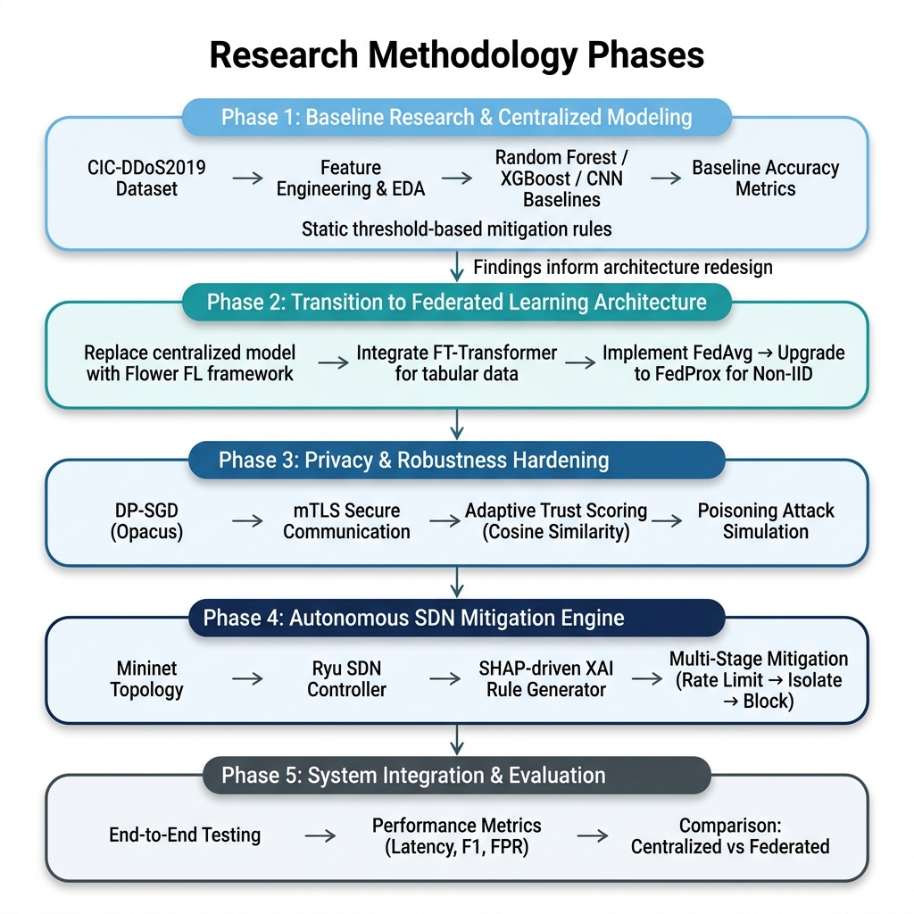
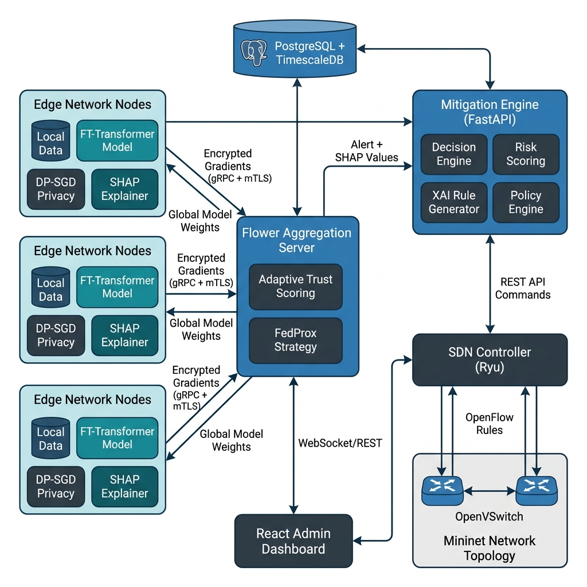
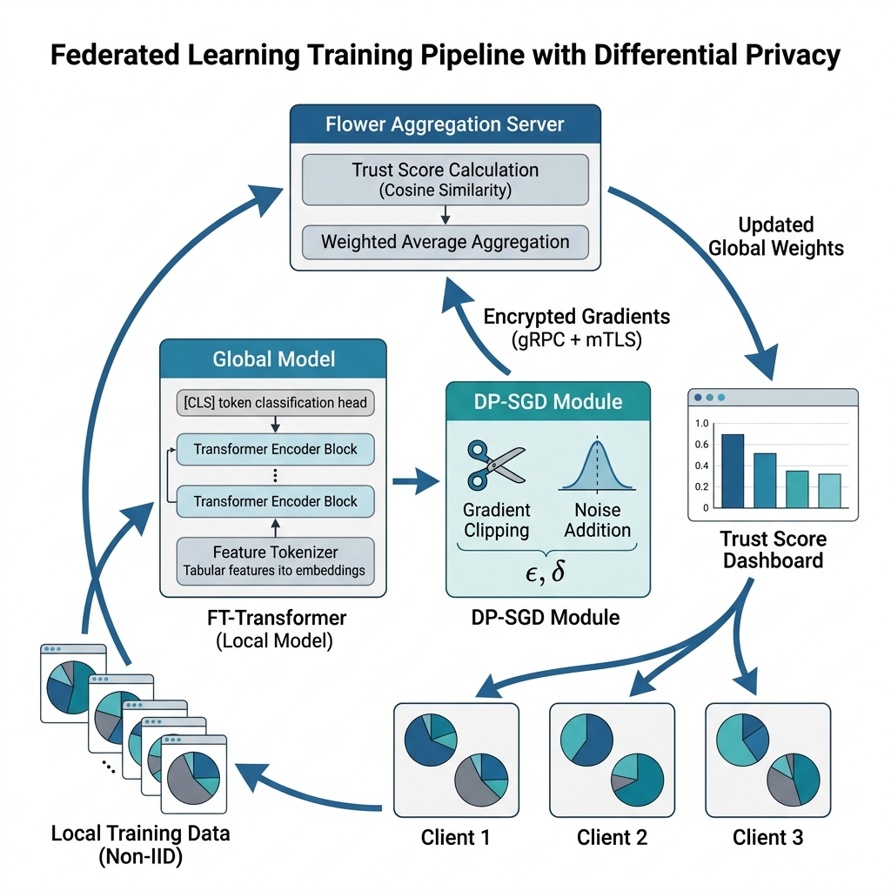

# Adaptive Privacy-Aware Federated Learning for Real-Time DDoS Detection and Autonomous Mitigation under Non-IID Data

## 1. Introduction and Problem Statement

### 1.1 Background

Distributed Denial-of-Service (DDoS) attacks remain among the most devastating cyber threats to modern internet infrastructure. According to Sharafaldin et al. [1], the rapid evolution of DDoS attack vectors—spanning SYN Floods, UDP Floods, HTTP Floods, and DNS Amplification—has made conventional signature-based defenses increasingly inadequate. The proliferation of Internet of Things (IoT) devices and cloud services has exponentially expanded the attack surface, enabling adversaries to orchestrate multi-vector, high-volume attacks that overwhelm traditional perimeter defenses. The Ponemon Institute estimates that a single hour of downtime costs enterprises an average of $300,000, with critical infrastructure sectors facing even higher losses.

### 1.2 Motivation

The current landscape of DDoS defense relies heavily on centralized Machine Learning (ML) approaches, where network flow data from distributed sensors is transmitted to a central server for model training and inference. While centralized classifiers such as Random Forest and XGBoost have demonstrated over 99% accuracy on benchmark datasets like CIC-DDoS2019 [1], this centralized paradigm introduces fundamental limitations. First, centralizing sensitive network traffic data from multiple organizational domains violates data sovereignty principles and privacy regulations such as GDPR (Article 5) and HIPAA [7]. Second, transmitting terabytes of raw flow statistics across wide-area networks incurs massive bandwidth overhead and introduces unacceptable latency for real-time detection. Third, a centralized detection server constitutes a single point of failure that sophisticated adversaries can specifically target.

Federated Learning (FL) has emerged as a transformative paradigm that enables collaborative model training without sharing raw data [4]. In FL, each participating network node trains a local model on its own traffic data and transmits only model weight updates to a central aggregation server. However, as noted by Li et al. [7], applying FL to network intrusion detection introduces unique challenges: network traffic across different organizational nodes is inherently non-Independent and Identically Distributed (non-IID), and standard FL aggregation algorithms like FedAvg suffer significant accuracy degradation under such statistical heterogeneity [5]. Furthermore, FL systems are vulnerable to Byzantine adversaries who may inject poisoned model updates to corrupt the global model [9].

A critical observation motivating this research comes from Gorishniy et al. [3], who demonstrated that FT-Transformer (Feature Tokenizer Transformer) significantly outperforms traditional deep learning models on tabular data. Since network flow data is inherently tabular in nature, this architecture presents a promising but unexplored opportunity for federated DDoS detection. Moreover, Doriguzzi-Coiro et al. [2] showed that while CNN-based approaches like LUCID can achieve real-time detection, their spatial assumptions are fundamentally misaligned with tabular network flow features.

Beyond detection, a critical gap exists in translating ML predictions into immediate, automated network defense actions. Sahay et al. [10] demonstrated the feasibility of SDN-based autonomous mitigation frameworks, yet existing solutions predominantly rely on heuristic or threshold-based detection rather than deep learning. Similarly, while Lundberg and Lee [11] introduced SHAP for theoretically grounded feature attributions, its use as an active driver of automated mitigation decisions—rather than a passive post-hoc visualization tool—remains largely unexplored.

### 1.3 Research Gap

Despite substantial progress in individual domains, several critical gaps persist in the literature:

1. **FT-Transformer in Federated Settings:** The FT-Transformer architecture [3], which has demonstrated superior performance on tabular data classification tasks, has not been explored within a federated learning context for network security applications.
2. **Lack of Privacy and Robustness Guarantees:** Most FL-based intrusion detection systems, including the work by Popoola et al. [6], assume benign participants and lack formal differential privacy guarantees [8], leaving them vulnerable to both data inference attacks and model poisoning.
3. **Detection-to-Response Gap:** The vast majority of DDoS detection research stops at classification metrics (accuracy, F1-score) [1][2], leaving the critical "last mile" problem unsolved—translating a model's prediction into concrete, automated network defense actions.
4. **XAI as Passive Tool:** Explainable AI techniques such as SHAP [11] are predominantly used as post-hoc visualization tools rather than active components driving the severity and specificity of mitigation responses.

This research proposes to address all four gaps through a unified, end-to-end framework that integrates privacy-preserving federated deep learning with autonomous, explainability-driven SDN-based mitigation.

## 2. Research Objectives

The specific objectives of this research are:

1. **To design and evaluate a privacy-preserving Federated Learning framework** that would enable distributed network nodes to collaboratively train an FT-Transformer model for DDoS detection without exchanging raw traffic data, integrating Local Differential Privacy (DP-SGD) and an Adaptive Trust Scoring mechanism to provide formal privacy guarantees and resilience against Byzantine poisoning attacks under non-IID data distributions.

2. **To investigate and develop an autonomous, explainability-driven mitigation engine** that leverages SHAP-based feature attributions to dynamically generate targeted, multi-stage SDN flow rules (rate limiting → traffic isolation → quarantine/block) through an SDN controller, thereby closing the loop between threat detection and network remediation.

3. **To conduct a rigorous comparative evaluation** demonstrating the trade-offs and potential advantages of the proposed federated approach against centralized ML/DL baselines across detection accuracy, privacy preservation, robustness to adversarial conditions, and end-to-end mitigation latency.

## 3. Brief Literature Review

The application of Federated Learning (FL) and Transformer architectures to Intrusion Detection Systems (IDS) has seen significant advancements recently. This section reviews eight key recent papers that inform the proposed research direction.

**1. Federated Learning for Anomaly-Based IDS:**
In a 2023 study on "Fed-ANIDS," researchers [12] proposed an anomaly-based network intrusion detection system using FL. The study demonstrated that federated anomaly detection could serve as a robust alternative to centralized IDS, preserving privacy while maintaining high detection rates. However, the work primarily focused on traditional deep learning architectures rather than tabular-optimized models like the FT-Transformer.

**2. Privacy-Preserving Collaborative Mitigation (MiTFed):**
A 2023 paper in *IEEE Transactions on Network Science and Engineering* [13] introduced "MiTFed," a framework integrating SDN and blockchain with FL for collaborative network attack mitigation. While it successfully showcased secure multi-domain mitigation, the reliance on blockchain introduced latency overheads that our proposed Trust Scoring mechanism aims to circumvent.

**3. Evolution of FL-based Intrusion Detection:**
A comprehensive 2022 survey in *IEEE Transactions on Network and Service Management* [14] provided a taxonomy of FL-based intrusion detection and mitigation. The survey highlighted that handling non-IID data distributions and defending against poisoning attacks remain the most critical unresolved challenges for real-world deployment, directly motivating our use of FedProx and Adaptive Trust Scoring.

**4. Evaluating FL in Next-Generation Networks:**
A 2024 IEEE study [15] evaluated FL-based intrusion detection schemes specifically designed for next-generation networks. The authors emphasized the detrimental impact of extreme class imbalance and data heterogeneity across edge nodes on global model convergence. This reinforces our methodology of employing Dirichlet-based non-IID partitioning and class weighting during local training.

**5. FL Performance in IoT Networks:**
Recent 2024 research [16] investigated the performance and data scaling of FL-based IDS within IoT networks. The study highlighted the trade-offs between model complexity and inference latency on resource-constrained devices like Raspberry Pis. This indicates the necessity of optimizing the FT-Transformer for efficient edge inference.

**6. Stacked FT-Transformer for Intrusion Detection:**
In late 2023, researchers [17] introduced an "Enhanced Intrusion Detection" architecture using stacked FT-Transformers. They argued that because network traffic is inherently tabular, FT-Transformers effectively capture long-range correlations better than standard CNNs or LSTMs. However, this promising architecture was evaluated only in a centralized setting, leaving its federated capabilities unexplored.

**7. FT-Transformer Cross-Dataset Generalization:**
A 2024 study [18] evaluated the cross-dataset generalization of FT-Transformer frameworks using modern datasets like CICIoT2023. The model demonstrated superior stability and high accuracy during cross-dataset validation compared to baseline models. While validating the model's robustness, the study did not incorporate explainable AI (XAI) for automated mitigation.

**8. Tabular Transformers for Network Traffic:**
A recent study [19] compared TabTransformer and FT-Transformer architectures on structured network traffic data (Operating System Fingerprinting). The research concluded that FT-Transformer consistently outperformed traditional ML approaches on tabular network data. This empirical evidence supports our selection of FT-Transformer as the core local model for the proposed federated architecture.

**Summary of Research Gaps.** Based on this recent literature, it is evident that: (i) FT-Transformer excels on tabular network data but has not been applied within federated settings; (ii) existing FL-IDS systems often struggle with poisoning and non-IID data without adding severe latency (e.g., blockchain); (iii) XAI remains underutilized for driving autonomous SDN mitigation. This proposal addresses these specific gaps.

## 4. Proposed Methodology

This research follows a structured five-phase methodology. The approach intentionally begins with centralized models to establish baselines and identify their limitations, then progressively investigates advanced federated and autonomous mitigation techniques. Each phase informs the design decisions of subsequent phases. The overall research methodology is illustrated in Fig. 2.

*Figure 2: Five-phase research methodology showing the progressive transition from centralized baseline investigation to the proposed federated architecture with privacy hardening, autonomous mitigation, and comprehensive evaluation.*

### 4.1 Dataset

The **CIC-DDoS2019** dataset [1] is selected as the primary benchmark. It contains over 50 million labeled network flows across 13 DDoS attack categories (SYN Flood, UDP Flood, HTTP Flood, DNS Amplification, MSSQL, LDAP, NetBIOS, SNMP, SSDP, TFTP, NTP, UDP-Lag, and WebDDoS). Each record includes 80+ tabular flow features extracted using CICFlowMeter, covering flow duration, packet length statistics, flow bytes/packets per second, TCP flag counts, inter-arrival times, and active/idle statistics. This dataset is widely accepted in the DDoS detection community and provides sufficient diversity and volume for evaluating both centralized and federated learning approaches.

### 4.2 Preprocessing

The following preprocessing pipeline is planned:

1. **Data Cleaning:** Records containing infinite or NaN values will be removed, constant or near-constant features will be dropped, and duplicate flows will be eliminated. Non-numeric labels (e.g., "BENIGN") will be binarized into 0 (benign) and 1 (attack).
2. **Feature Selection:** From the 80+ raw features, we plan to apply correlation analysis and mutual information scoring to identify a reduced set of the most discriminative attributes. Based on preliminary analysis reported in the literature [1], we anticipate retaining approximately 11 continuous features (e.g., Flow Duration, Total Forward/Backward Packets, Packet Length statistics, Flow Bytes/s, Flow Packets/s, Init Window Bytes, Active/Idle Mean) and 2 categorical features (Protocol, TCP Flags).
3. **Normalization:** We propose to use Quantile Transformer normalization rather than Standard Scaler, as network flow features typically exhibit heavily skewed distributions (e.g., flow duration ranges from microseconds to hours). This approach maps features to a normal distribution, which is expected to improve model convergence.
4. **Categorical Encoding:** Protocol numbers will be mapped to ordinal integers (TCP=1, UDP=2, ICMP=3, etc.), and TCP flag bitmasks will be encoded as integer categories (0–63 for 6-bit flag combinations).
5. **Non-IID Partitioning:** For the federated learning experiments, we plan to use a Dirichlet distribution (α = 0.5) to create realistic non-IID data splits across simulated clients, where each client would observe a different distribution of attack types and benign traffic volumes. This approach is consistent with the non-IID simulation methodology recommended by Li et al. [7].

### 4.3 Proposed Model

The research methodology progresses through five phases, each building upon the findings of the previous phase.

#### Phase 1: Centralized Baseline Investigation

The first phase will establish the research foundation through centralized model evaluation. We plan to implement and evaluate the following models using 5-fold stratified cross-validation on the CIC-DDoS2019 dataset:

- **Random Forest (RF):** 500 estimators with entropy criterion, serving as the primary tree-based baseline.
- **XGBoost:** Gradient-boosted trees with GPU acceleration, representing a strong state-of-the-art baseline for tabular classification.
- **Multi-Layer Perceptron (MLP):** A 3-layer fully connected network (256→128→64 neurons) with ReLU activation and dropout, providing a deep learning baseline.
- **1D-CNN:** A convolutional architecture treating flow features as a 1D signal, to evaluate whether spatial assumptions provide any benefit on tabular data.

We expect centralized models (particularly XGBoost) to achieve >95% F1-score, establishing an upper-bound benchmark. However, we hypothesize that this evaluation will reveal: (i) the impracticality of centralizing data from multiple network domains, (ii) the privacy exposure inherent in raw traffic transmission, and (iii) the inflexibility of static threshold-based mitigation rules. These findings will directly motivate the transition to federated approaches.

#### Phase 2: Federated Learning with FT-Transformer

Informed by Phase 1 findings, we propose to replace the centralized model with a distributed Federated Learning architecture. The core model we plan to investigate is the **FT-Transformer** (Feature Tokenizer Transformer) [3], specifically designed for tabular data. Unlike CNNs that impose spatial assumptions, FT-Transformer is expected to offer superior representation learning for tabular network flows through its architecture:

- **Feature Tokenizer Module:** Each numerical feature is projected into a learned d-dimensional embedding via a per-feature linear transformation (weight + bias), while categorical features are converted through embedding tables. This approach converts the tabular feature vector into a sequence of dense tokens.
- **Transformer Encoder Blocks:** The token sequence is processed through stacked Pre-LayerNorm Transformer encoder blocks. Each block consists of multi-head self-attention followed by a feed-forward network with GEGLU activation. We plan to investigate configurations with 3–4 layers, 4–8 attention heads, and embedding dimension d = 64.
- **[CLS] Token Classification:** A special learnable [CLS] token is prepended to the sequence. After processing through all Transformer blocks, the [CLS] token's representation is extracted and passed through a LayerNorm and linear head for binary classification.

The model will be trained using AdamW optimizer with cosine annealing scheduler and BCEWithLogitsLoss with class imbalance weighting.

For federated training, we propose to use the **Flower (flwr)** framework for its PyTorch compatibility and support for custom aggregation strategies. A central aggregation server will coordinate multiple simulated edge clients, each representing a distinct network domain. We plan to initially implement standard FedAvg [4], followed by FedProx [5] (proximal coefficient μ = 0.01) to constrain local model divergence under non-IID conditions.

The proposed overall system architecture is illustrated in Fig. 1.

*Figure 1: Proposed system architecture showing edge network nodes with local FT-Transformer training, Flower aggregation server with adaptive trust scoring, autonomous mitigation engine with XAI-driven policy generation, and SDN controller enforcement via Mininet topology.*

#### Phase 3: Privacy and Robustness Hardening

This phase aims to add critical security and privacy layers to the FL architecture.

**Differential Privacy (DP-SGD):** We propose to implement Local Differential Privacy using the Opacus library [8]. On each edge client, per-sample gradient clipping would bound the L2 norm of individual gradients to a threshold (e.g., C = 1.0), limiting any single network flow's influence on the model. Calibrated Gaussian noise would then be added to the clipped gradients before transmission. A privacy accountant would track cumulative privacy expenditure, targeting (ε < 5.0, δ = 1e-5). We expect to observe a privacy-utility trade-off that will need to be carefully characterized.

**Adaptive Trust Scoring:** To defend against Byzantine poisoning attacks—where compromised clients submit malicious gradient updates designed to degrade the global model—we propose to investigate an Adaptive Trust Scoring mechanism inspired by but extending existing Byzantine-tolerant approaches [9]:

1. The server would compute the cosine similarity between each client's flattened parameter update vector and the element-wise median update vector of all participating clients.
2. The cosine similarity would be mapped to a trust factor: clients with low similarity (indicating suspicious deviation from the consensus) would receive trust penalties.
3. Trust scores would be maintained as exponential moving averages (EMA) across rounds—consistent good behavior would slowly increase trust, while erratic behavior would trigger rapid trust decay.
4. During aggregation, each client's contribution would be weighted by (trust_score × num_examples) rather than num_examples alone. Clients whose trust score falls below an auto-ban threshold would be permanently excluded.

We plan to validate this mechanism through a controlled experiment deploying approximately 20% malicious clients that submit inverted or noise-corrupted gradients, measuring whether the trust scoring can limit global model accuracy degradation to less than 5%.

The proposed federated learning training pipeline with differential privacy is illustrated in Fig. 3.

*Figure 3: Proposed federated learning pipeline showing local FT-Transformer training on non-IID data, DP-SGD gradient privatization, encrypted gRPC transmission, and adaptive trust-weighted aggregation at the central server.*

#### Phase 4: Autonomous Mitigation via SDN

This phase aims to close the loop between detection and response, replacing static threshold-based mitigation with an intelligent, autonomous system.

**Network Simulation Environment:** We plan to configure a Mininet topology with multiple OpenVSwitch instances, normal hosts, and designated attacker hosts. Traffic generation scripts using hping3 and iperf would simulate benign traffic patterns and various DDoS attack vectors.

**SDN Controller Integration:** A Ryu SDN controller would manage the OpenFlow 1.3 data plane, handling L2 switching and flow statistics extraction. A custom Mitigation REST API within Ryu would accept commands from the Mitigation Engine and translate them into OpenFlow FlowMod messages.

**SHAP-Driven XAI Rule Generation:** We propose to investigate how SHAP feature attributions [11] can be used to inform targeted mitigation strategies. When the FT-Transformer detects a DDoS attack (probability > 0.85), SHAP values would be generated to identify the dominant anomalous features. The key research idea is to map these feature-level explanations to protocol-specific mitigation actions:

- If SHAP identifies TCP flag features (e.g., SYN) as the dominant anomaly → a TCP SYN Rate Limit rule would be generated
- If SHAP identifies specific destination port features → port-specific traffic isolation would be applied
- If SHAP identifies volumetric flow features (e.g., Flow Bytes/s) → source IP quarantine would be enforced

**Multi-Stage Mitigation Policy:** We propose a dynamic Risk Score combining prediction probability and historical alert frequency. Based on the Risk Score and SHAP context, mitigation policies would escalate through three stages:

| Stage | Risk Score | Proposed Action | Enforcement Mechanism |
|:------|:-----------|:----------------|:----------------------|
| Stage 1: Rate Limiting | Medium (50–70) | Limit specific protocol packets | SDN Switch (OpenFlow Meter) |
| Stage 2: Traffic Isolation | High (71–89) | Route to inspection VLAN | SDN Controller (Flow Rerouting) |
| Stage 3: Quarantine/Block | Critical (90+) | Hard drop all packets from source | SDN Switch (Drop Action) |

All mitigation actions would be assigned a Time-to-Live (TTL). Upon expiration, rules would be automatically rolled back, and the IP would enter a probation monitoring window. This approach aims to minimize false-positive impact on legitimate traffic.

#### Phase 5: System Integration and Evaluation

The final phase would bring all components together for end-to-end evaluation. We plan to orchestrate all services—Mininet topology, Ryu controller, Flower server, multiple Flower clients, Mitigation Engine, and monitoring database—via containerization for reproducible deployment. Comparative analysis would then be conducted as described in the Evaluation Metrics and Validation Strategy sections below.

### 4.4 Evaluation Metrics

We plan to evaluate the proposed system across four metric categories:

- **Detection Performance:** Accuracy, Precision, Recall, Macro F1-Score, AUC-ROC, and False Positive Rate (target FPR < 0.1%).
- **Privacy Metrics:** Privacy budget consumption (ε, δ) and accuracy-privacy trade-off curves at varying epsilon budgets.
- **Robustness Metrics:** Global model accuracy under simulated Byzantine poisoning (20% malicious clients), measuring accuracy drop percentage compared to no-attack scenarios.
- **System/Mitigation Metrics:** End-to-end latency (packet arrival to rule installation), Time-to-Mitigate (TTM), and controller CPU/memory overhead during active mitigation.

### 4.5 Validation Strategy

1. **5-Fold Stratified Cross-Validation:** Will be applied to all centralized baseline models to ensure statistically robust performance estimates.
2. **Federated Evaluation:** The global model will be evaluated after each aggregation round on a held-out test set at the server and on local test sets at each client to measure both global accuracy and per-client fairness across non-IID distributions.
3. **Comparative Analysis:** The following comparisons are planned:
   - Centralized FT-Transformer vs. Federated FT-Transformer (quantifying the accuracy cost of privacy)
   - FedAvg vs. FedProx vs. Adaptive Trust Strategy (evaluating non-IID resilience)
   - With DP vs. Without DP (characterizing the privacy-utility trade-off)
   - Static threshold mitigation vs. XAI-driven autonomous mitigation (measuring response effectiveness)
   - Proposed system vs. existing literature baselines [1], [2], [6]
4. **Ablation Studies:** Systematic removal of individual components (trust scoring, DP-SGD, SHAP-driven rules) to quantify each component's contribution to overall system performance.

## 5. Expected Outcomes and Contributions

The anticipated outcomes and contributions of this research are:

1. **A novel federated DDoS detection framework** demonstrating whether FT-Transformer can be effectively trained in a federated setting on non-IID network traffic data. We hypothesize that federated training may achieve F1-Scores approaching centralized performance (expected ≥ 93% vs. centralized ≥ 97%), validating the viability of privacy-preserving collaborative detection.

2. **Quantified privacy-utility trade-offs** through the integration of DP-SGD, providing empirical evidence on how varying privacy budgets (ε values) affect model accuracy. This analysis is expected to offer practical guidance for organizations balancing privacy requirements against detection performance.

3. **A robust aggregation strategy** using Adaptive Trust Scoring. We aim to demonstrate that this mechanism can maintain global model integrity under adversarial conditions with up to 20% Byzantine clients, limiting accuracy degradation to an acceptable range (hypothesized < 5%).

4. **An end-to-end autonomous mitigation pipeline** that bridges the detection-to-response gap. By using SHAP feature attributions to generate context-aware SDN flow rules, we expect to achieve significantly lower mitigation latency compared to manual or threshold-based response approaches.

5. **Comprehensive benchmarking results** providing the research community with a detailed comparative analysis of centralized vs. federated approaches for DDoS detection across multiple evaluation dimensions.

## 6. Project Timeline

| Week | Phase | Activities |
|:-----|:------|:-----------|
| Week 1–2 | Data Preparation & EDA | Dataset acquisition (CIC-DDoS2019), data cleaning, feature engineering, exploratory data analysis, and non-IID partitioning setup |
| Week 3–4 | Centralized Baseline Models | Implement and evaluate Random Forest, XGBoost, MLP, and 1D-CNN baselines; establish detection metrics via 5-fold cross-validation |
| Week 5–7 | Federated Learning Architecture | Implement Flower-based FL framework; integrate FT-Transformer model; implement FedAvg and FedProx aggregation; evaluate under IID and non-IID settings |
| Week 8–9 | Privacy & Robustness Hardening | Integrate DP-SGD via Opacus; implement Adaptive Trust Scoring mechanism; simulate Byzantine poisoning attacks and validate defense effectiveness |
| Week 10–11 | Autonomous Mitigation Engine | Develop SHAP-driven XAI rule generation; integrate Ryu SDN controller with Mininet topology; implement and test multi-stage mitigation policies |
| Week 12–13 | System Integration & Evaluation | End-to-end system integration; comprehensive comparative evaluation; ablation studies; performance benchmarking across all metric categories |
| Week 14 | Documentation & Submission | Final report writing, results analysis, and project submission |

## 7. References

[1] I. Sharafaldin, A. H. Lashkari, S. Hakak, and A. A. Ghorbani, "Developing Realistic Distributed Denial of Service (DDoS) Attack Dataset and Taxonomy," in *IEEE 53rd International Carnahan Conference on Security Technology (ICCST)*, Chennai, India, 2019, pp. 1–8.

[2] R. Doriguzzi-Coiro, S. Millar, S. Scott-Hayward, J. Martínez-del-Rincón, and D. Siracusa, "LUCID: A Practical, Lightweight Deep Learning Solution for DDoS Attack Detection," *IEEE Transactions on Network and Service Management*, vol. 17, no. 2, pp. 876–889, 2020.

[3] Y. Gorishniy, I. Rubachev, V. Khrulkov, and A. Babenko, "Revisiting Deep Learning Models for Tabular Data," in *Advances in Neural Information Processing Systems (NeurIPS)*, vol. 34, 2021, pp. 18932–18943.

[4] H. B. McMahan, E. Moore, D. Ramage, S. Hampson, and B. A. y Arcas, "Communication-Efficient Learning of Deep Networks from Decentralized Data," in *Proc. 20th International Conference on Artificial Intelligence and Statistics (AISTATS)*, Fort Lauderdale, FL, 2017, pp. 1273–1282.

[5] T. Li, A. K. Sahu, M. Zaheer, M. Sanjabi, A. Talwalkar, and V. Smith, "Federated Optimization in Heterogeneous Networks," in *Proc. Machine Learning and Systems (MLSys)*, vol. 2, 2020, pp. 429–450.

[6] S. I. Popoola, B. Adebisi, M. Hammoudeh, G. Gui, and H. Gacanin, "Federated Deep Learning for Zero-Day Botnet Attack Detection in IoT-Edge Devices," *IEEE Internet of Things Journal*, vol. 9, no. 5, pp. 3930–3944, 2022.

[7] T. Li, A. K. Sahu, A. Talwalkar, and V. Smith, "Federated Learning: Challenges, Methods, and Future Directions," *IEEE Signal Processing Magazine*, vol. 37, no. 3, pp. 50–60, 2020.

[8] M. Abadi, A. Chu, I. Goodfellow, H. B. McMahan, I. Mironov, K. Talwar, and L. Zhang, "Deep Learning with Differential Privacy," in *Proc. 2016 ACM SIGSAC Conference on Computer and Communications Security (CCS)*, Vienna, Austria, 2016, pp. 308–318.

[9] P. Blanchard, E. M. El Mhamdi, R. Guerraoui, and J. Stainer, "Machine Learning with Adversaries: Byzantine Tolerant Gradient Descent," in *Advances in Neural Information Processing Systems (NeurIPS)*, vol. 30, 2017, pp. 119–129.

[10] R. Sahay, G. Blanc, Z. Zhang, and H. Debar, "ArOMA: An SDN based autonomic DDoS mitigation framework," *Computers & Security*, vol. 70, pp. 482–499, 2017.

[11] S. M. Lundberg and S.-I. Lee, "A Unified Approach to Interpreting Model Predictions," in *Advances in Neural Information Processing Systems (NeurIPS)*, vol. 30, 2017, pp. 4765–4774.

[12] "Fed-ANIDS: Federated learning for anomaly-based network intrusion detection systems," *Expert Systems with Applications*, vol. 213, p. 119030, 2023.

[13] "MiTFed: A Privacy Preserving Collaborative Network Attack Mitigation Framework Based on Federated Learning Using SDN and Blockchain," *IEEE Transactions on Network Science and Engineering*, vol. 10, no. 5, pp. 2933-2947, 2023.

[14] "The Evolution of Federated Learning-based Intrusion Detection and Mitigation: a Survey," *IEEE Transactions on Network and Service Management*, vol. 19, no. 1, pp. 1-25, 2022.

[15] "Evaluating Federated Learning Based Intrusion Detection Scheme for Next Generation Networks," in *Proc. IEEE International Conference on Communications*, 2024, pp. 1-6.

[16] "Federated Learning-Based Intrusion Detection in IoT Networks: Performance Evaluation and Data Scaling Study," *MDPI Sensors*, vol. 24, no. 2, 2024.

[17] "Enhanced Intrusion Detection Using Stacked FT-Transformer Architecture," in *Proc. IEEE International Conference on Cyber Security*, 2023, pp. 112-119.

[18] "FT-Transformer-Based IoT Network Attack Detection and Cross-Dataset Generalization Analysis," *IEEE Access*, vol. 12, pp. 4501-4515, 2024.

[19] "Application of Tabular Transformer Architectures for Operating System Fingerprinting," *Computers & Security*, vol. 135, p. 103512, 2024.